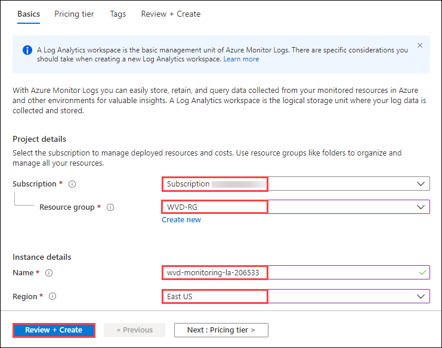

# Exercise 1: Create Log Analytics and associate it with WVD

## Task 1: Create Log Analytics

1. On the Azure portal, click on **Create a resource** given under Azure services.

   

2. Type *Log Analytics Workspace* in the search bar a click on **Log Analytics Workspace** from the suggestions.

   

3. On the Log Analytics Workspace page, click on **Create**.

   

4. Now add the following configurations:

  - Subscription: *Choose the default subscription.*
  - Resource group: *Select **WVD-RG** from the drop down.*
  - Name: **wvd-monitoring-la-[uniqueid]** (*for example: wvd-monitoring-la-206533*)
  - Region: **East US**, *basically this should be same as the region of your resource group.*
  - Click on **Review + Create**

   

5. The last window helps us to verify if the parameters we filled are correct. Wait for validation to pass, then click on **Create** to initiate the deployment.

   

6. Once the deployment gets succeeded, go to **Windows Virtual Desktop**.

   

7. Open on **Host Pools** and then click on **WVD-HP-01**.

   

8. Now click on **Diagnostic settings** present under **Monitoring** blade, then click on **+Add diagnostic setting**.

   

9. Add the following configurations:

  - Diagnostic settings name: **HostPoolMonitoring**
  - Category details: *Check all the boxes present under logs i.e.,* **Checkpoint, Error, Management, Connection & HostRegistration.** 
  - Send to Log Analytics: *Check the box*
  - Subscription: *Choose the default subscription.*
  - Log Analytics Workspace: *Select the log analytics workpsace(i.e.,**wvd-monitoring-la-[uniqueid]**) from the drop down, that we just created.*
  - At last, click on **Save**.

   

10. Navigate back to Windows Virtual Desktop and open **Application groups**.

   
   
11. Click on **WVD-HP-01-DAG**. Then select **Diagnostic settings** present under **Monitoring** blade and click on **+Add diagnostic setting**.

    
   
12. Add the following configurations:

  - Diagnostic settings name: **ApplicationGroupMonitoring**
  - Category details: *Check all the boxes present under logs i.e.,* **Checkpoint, Error & Management.** 
  - Send to Log Analytics: *Check the box*
  - Subscription: *Choose the default subscription.*
  - Log Analytics Workspace: *Select the log analytics workpsace(i.e.,**wvd-monitoring-la-[uniqueid]**) from the drop down, that we just created.*
  - At last, click on **Save**.

   
   
13. Navigate back to Windows Virtual Desktop and open **Workspaces**.

   
   
14. Click on **WVD-WS-01**. Then select **Diagnostic settings** present under **Monitoring** blade and click on **+Add diagnostic setting**.    
   
   
 
15. Add the following configurations:

  - Diagnostic settings name: **WorkspaceMonitoring**
  - Category details: *Check all the boxes present under logs i.e.,* **Checkpoint, Error, Management & Feed.** 
  - Send to Log Analytics: *Check the box*
  - Subscription: *Choose the default subscription.*
  - Log Analytics Workspace: *Select the log analytics workpsace(i.e.,**wvd-monitoring-la-[uniqueid]**) from the drop down, that we just created.*
  - At last, click on **Save**.  
   
   
   
16. Now navigate to *Log Analytics Workspace*, then select **Logs** under *General* blade. 

   

17. Close the *Example queries* window.

   

18. Now in *Query Explorer*, paste the following query and click on **Run** button.

```
WVDConnections 
|sort by TimeGenerated asc, CorrelationId
|summarize Connectcount = dcount(CorrelationId) by bin(TimeGenerated, 1d),UserName = toupper(trim_end("@.*",UserName))
```
   
   

19. In results, logs will appear similar to one shown below.

   

20. Click on the **Next** button present in the bottom-right corner of this lab guide.


