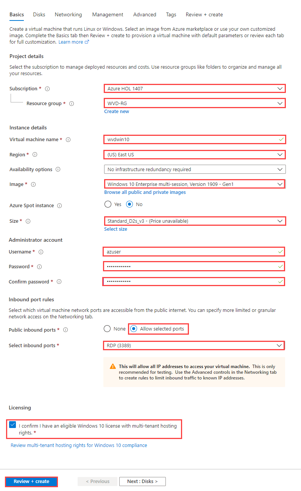

# Exercise 8: Create a master image for WVD

In this exercise we are going to walk through the process of creating a master image for your WVD host pools. The basic concept for a master image is to start with a clean base install of Windows and layer on mandatory updates, applications and configurations. There are many ways to create and manage images for WVD. The steps covered in this exercise are going to walk you through a basic build and capture process that includes core applications and recommended configuration options for WVD.

## **Task 1: Create a new Virtual Machine in Azure**

1. On the Azure portal home page, Select Create a resource.

   

2. Search and select **Microsoft Windows 10**.

   

3. From dropdown menu select **Windows 10 Enterprise multi-session, Version 1909** and click on create **Create**.

   

4. Provide the below configuration for the virtual machine, and click on **Review + create** and then click on **create**.

   - Subscription: *Choose the default subscription.*
   - Resource Group: *Select WVD-RG from the drop down.*
   - Virtual machine name: **wvdwin10**
   - Region: **EastUS**, *basically this should be same as the region of your resource group.*
   - Image: **Windows 10 Enterprise multi-session, Version 1909-Gen1**
   - Size: **Standard_D2s_v3**
   - Username: **azuser**
   - Password: **Azure1234567**
   - Confirm Password: **Azure1234567**
   - Public inbound ports: select **Allow selected ports**
   - Select inbound ports: **RDP(3389)**
   - **Select** the checkbox saying *"I confirm I have an eligible Windows 10 license with multi-tenant hosting rights."*

   <kbd></kbd>

5. After deployment of virtual machine completes, click on **Go to resource**.

   

6. Click on **Connect** and select **RDP** from the dropdown.

   

7. Click on **Download RDP file**.

   

8. Click on the downloaded RDP file to open it.

   

9. Now in the following RDP client window click on **Connect** to esablish a RDP connection to your virtual machine.

   

10. Enter your virtual machine *credentials* and click **OK**.

   - Username: **azuser**
   - Password: **Azure1234567**
   
   

11. The virtual machine will look similar to the one shown below.

   

## **Task 2: Run Windows Update**

Despite the Azure support teams best efforts, the Marketplace images are not always up to date. The best and most secure practice is to keep your master image up to date.

1. In the virtual machine, click on **Start** button and open **Settings**.

   

2. Select **Updates & Security** in the *Settings*.

   

3. Click on **Download** to download and install available windows updates.

   

>**Note:** If the installation of update asks to restart the virtual machine then restart the vm and continue with the next task.

## **Task 3: Prepare WVD image**

**Introduction to the script**

The authors for this content have developed a scripted solution to assist in automating some common baseline image build tasks. The script includes a UI form, enabling you to quickly select which actions to perform. The end result will be a custom master image that incorporates Microsoft's main business applications, along with the necessary policies and settings for an optimized user experience.

The script and related tools are maintained in GitHub.

For additional documentation about the script (e.g. parameters, functions, etc.), refer to the comments in Prepare-WVDImage.ps1.

For troubleshooting script execution, refer to the following log directory on the target machine: C:\Windows\Logs\ImagePrep.

This script leverages the Local Group Policy Object (LGPO) tool in the Microsoft Security Compliance Toolkit (SCT) to apply settings in the image. The settings are documented and exported on the target machine under C:\Windows\Logs\ImagePrep\LGPO. This approach was taken to simplify troubleshooting, enabling you to leverage Group Policy Results.

The UI form offers the following actions:

**Office 365 ProPlus**

-   Install the **latest** version of Office 365 ProPlus monthly channel.

**OneDrive for Business**

-   Install the **latest** version of OneDrive for Business *per-machine*.

**Microsoft Teams**

-   Install the **latest** version of Microsoft Teams *per-machine*.

**Microsoft Edge Chromium**

-   Install the **latest** version of Microsoft Edge Enterprise.

**FSLogix Profile Containers**

-   Install the **latest** version of the FSLogix Agent.

-   Apply recommended settings.

**OS Settings**

-   Apply the recommended WVD settings for image capture.

**Running the script**

1. Now inside your virtual machine click on **Start** and open **Microsoft edge browser**.

   

2. Copy and paste the URL below and click on **Save** to download the *Customizations.zip* file.

   `https://minhaskamal.github.io/DownGit/#/home?url=https://github.com/shawntmeyer/WVD/tree/master/Image-Build/Customizations`

   

3. Open file explorer and go to *Downloads directory*, there **right click** on *Customizations.zip* and select **Extract All**.

   

4. A new window will open, click on **Extract**.

   

5. Now on your virtual machines taskbar search for *Powershell*, and then select **Run as administrator**.

   

6. Use the following command to navigate to "C:\Users\(loginaccount)\Documents\Customizations".

   ` cd C:\Users\azuser\Downloads\Customizations\Customizations `

7. Run the following command to allow for script execution.

   ` Set-ExecutionPolicy -ExecutionPolicy Bypass -Scope Process -Force `

8. Execute the script by running the following command.

   ` .\Prepare-WVDImage.ps1 -DisplayForm `

9. This will trigger the powershell to launch an application, here select the applications shown below and click on **Execute**.

   

> **Note:** Make sure that the *FSlogix VHD location* and *AAD Tenant ID* columns are left **blank**.

>**Note:** The script will begin configuring the image. **DO NOT close any of the remaining windows that appear until the script has finished execution**. Doing so will interrupt the process and will require you to start over.
>The script will take several minutes to complete depending on the options you selected. Additional input from you is not required during this stage.

> **Note:** This script takes some time to run, so be patient as it may seem like nothing is happening for a while, and then applications will begin to install. You can watch the status from within PowerShell. After the Disk Cleanup Wizard closes, you may notice the PowerShell window does not update. It is waiting for the cleanmgr.exe process to close, which can take some time. You can select the PowerShell window and continue to hit the up arrow on your keyboard until you are presented with an active prompt.

10. After the script has completed, select the **Start** icon and note that Microsoft Office, Microsoft Edge Chromium, and Microsoft Teams have been installed.

    

11. Now open file explorer and delete *customizations.zip* file and *Customizations* folder from downloads.

    

12. After erforming the above steps, go to **Start** and **Restart** your virtual machine.

    

13. Click on **Continue** and on prompt click on **restart anyway**.

    

# **Task 4: Run Sysprep**

1. After the VM has rebooted, reconnect your RDP session and sign in using the same credentials.

   - username: azuser
   - password: Azure1234567

2. In taskbar search for *command prompt* and select **Run as administrator**.

   

3. Navigate to "C:\Windows\System32\Sysprep" by running the command below.

   ` cd C:\Windows\System32\Sysprep `

4. Run the following command to sysprep the VM and shutdown.

   ` sysprep.exe /oobe /generalize /shutdown `

> **Note:** The system will automatically shut down and disconnect your RDP session.

## **Task 5: Create a managed image from the Master Image VM**

1. In Azure portal search for *virtual machine* and click on it.

   

2. On the Virtual machines blade, locate the VM you used for your master image and Select on the name.

   

3. On the Overview blade for your VM, confirm the Status shows Stopped. Select Stop in the menu bar to move it to a deallocated state.

   

4. Click **OK** on the prompt.

   

5. When virtual machine is *deallocated*, click on **Capture**.

   

6. Enter name of your virtual machine i.e **vmforimage** and click on **Create**.

   

7. After image is created, in search bar of Azure portal search for **images** and select it.

   

## **Task 6: Provision a Host Pool with a custom image**

1. In azure portal Search for **Windows Virtual Desktop** and select it.

   

2. Under Manage, select Host pools and Select + Add.

   

3. On the **Basics** tab configure your hostpool with following configuration and click on **Next: Virtual Machines>**

   

   - Host pool name: **wvd-hostpool*
   - location: *Default location of resource group*
   - Validation Environment: **No**
   - Host pool type: Personal
   - Assignment type: **Automatic**

4. In the Virtual machines tab, select **Yes** against **Add virtual machines**. By doing this, we are stepping towards adding Virtual machines to the host pool.

   

5. In this step, we will provide the details of the VMs to be created as session Hosts. For your convenience, this step is divided into three sections as follows:

  **A.** Session Host Specifications:

   - Resource Group: Select **WVD-RG** from the drop down.
   - Virtual machine location: **East US**, location should be same as location of your resource group.
   - Virtual machine size: **Standard D1_v2**. Click on **Change Size**, then select **D1_v2** and click on **Select** as shown below

   

   - Number of VMs: **2**
   - Name prefix: **VmFromImage**
   - Image type: **Gallery**
   - Image: click on **Browse all images and disks** and select the Image we created earlier in this exercise, as shown below:

   

   - OS disk type: **Standard SSD**
   - Use managed disks: **Leave to default**

   

  **B**. Network and Security:

  Leave all values to default, except:

   - Subnet: **sessionhosts-subnet(10.0.1.0/24)** (choose from dropdown)
   - Specify Domain or Unit: **No**

   

  **C**. Administrator Account details:

   - AD domain join UPN: Paste your username
   - Password: Paste the password
   - Confirm Password: Paste the password again.

   

6. Click on **Next: Workspace** to proceed.

  
7. In the Workspace section, we need to specify if we need to register the default application group to a workspace.

   - Register desktop app group: Choose **Yes**
   - To this workspace: Click on **Create new**

   

8. Once you click on Create new, a small window pops up, where you can specify the Workspace name you are going to create.

   - Workspace name: **WVD-WS-02**
   - Click on **OK**

   

10. Now click on **Review + create** on the bottom left corner.

    

11. The last window helps us to verify if the parameters we filled are correct. Wait for validation to pass, then click on **Create** to initiate the deployment.

    

## **Task 10: Assign an Azure AD group to an application group**

1. In search bar of Azure portal, search for *Windows virtual desktop* and click on it.

   

2. Under Manage, select Application groups.

3. Locate the Default Application group that was created while creating hostpool in this exercise.

4. Under Manage, select **Assignments** and Select **+ Add**.

5. In the fly out, enter *ODL* in the search to find the name of your ODL User and select it.

6. Choose **Select** to save your changes.

## **Task 11: Connect to WVD with the web client**

1. In your web browser, navigate to the URL below. 

   ` https://rdweb.wvd.microsoft.com/arm/webclient `

>**Note:** We will be asked to login when we access the above URL. The credentials that we use are those from the lab.

2. Sign in using a synchronized identity that has been assigned to an application group.

